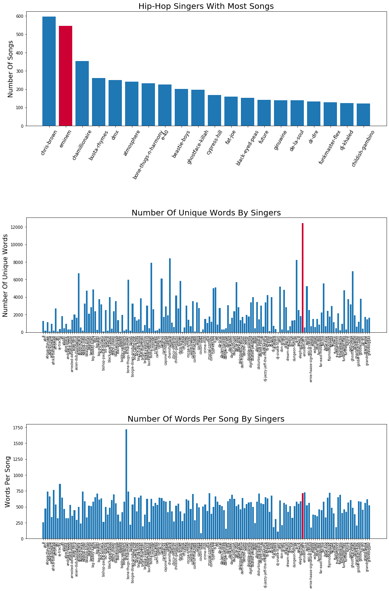

# How To Become A Successful Hip-Hop Star? What's Unique About Hip-Hop?

There are many treasures hidden behind the lyrics, and we can find many rules and characteristics by exploring them. If you have ever dreamed of becoming a hip hop singer, you may want to get some inspiration through the secrets hidden in the lyrics.

The dataset we've got is from  [Kaggle](https://www.kaggle.com/gyani95/380000-lyrics-from-metrolyrics). It contains lyrics in 125704 songs from all variety of genres and ranging from year 1968 to 2016. 

[TOC]

## Part 1. Keep Up With Hip-Hop

Let's start our journey with analyzing the most common used words in the lyrics. 

### 1. Evolution Of All Lyrics

The following word cloud plots are showing the transition of frequent words appearing in all songs during the half century. Each one summarizes the 30 most popular words in a decade.

From the above picture we can see that in these decades, the songs are basically created around a couple of core words. Topics about love and time are always the eternal theme in lyrics and do not fade as time pass by. 

But if you think you don't need to be creative to become a successful Hip-Hop singer, then you are very wrong. Life is never that simple.

### 2. Evolution Of Hip-Hop Lyrics

Now Let's take a look at the evolution for Hip-Hop only.

According to the word clouds above, there are some interesting changes. First of all, in the early days of Hip-Hop songs, they don't really care about love. The pursuit of sensuality and material is their focus. In the following decades, the trend start to behave like other genres talking about love and time. Another interesting situation is that dirt words are used more frequent than other songs. 

Hip-hop originated from the bottom people of the United States. At that time, the United States had huge problems such as huge gap between the rich and the poor and racial discrimination. In the face of a huge class divide, the black people who are discriminated against are destitute, are powerless to change. They can only choose to use dirty words and expressions to vent their dissatisfaction with social injustice and dissatisfaction with white people.

From another perspective, if you want to be a qualified hip hop singer, you need to be comfortable with dirty words.

## Part 2. Exceptional Hip-Hop 

In this part, we compare the differeces bettwen Hip-Hop and other genres from multiple aspects.

### 1. Most Common Words

By spearting out the Hip-Hop from all other styles, we can have a clear comparison about the most common words.

Although Hip-Hop singers like to use dirty languages, the words like 'love', 'time', 'baby' still appears in both categories and rank top. It says these topics are really the most concerned ones among all works of life. 

This shows that if you want to be a Hip-Hop singer, you don't need to be completely different from everyone else. There are many similarities between the singers' hotspots and the topics they want to express. You just need to learn to say more swearing words.

### 2. Size Of Vocabulary

In this part, I want to find some characteristics of Hip-Hop song's word numbers. We all know that Hip-Hop needs to speek fast, but how much faster are they? The following graphs show the characteristics of average word count by all genres.

The bar plot above shows that the average words per song are more than twice as many others, which makes this type of genre very distinct. As a common confusion, R&B is hardly distinguished from Hip-Hop by many people. But as depicted above, the number of words bettwen these two are enormous.

In addition, with the assumption that the average song length is almost the same across different genres, it can be concluded that Hip-Hop singers must speak more than twice as faster as other singers. 

From the box diagram above, we can also see that there are about 25 percent Hip-Hop whose lyrics are in the same range of other genres. This means if you can't sing very fast, you still have chance to become a Hip-Hop singer.

### 3. Amount Of Profanity

Since we all know that Hip-Hop songs like to use junk words, how often do they use them? Now we pick out the four most common swear words and compare their frequencies to other non-hip hop styles.

Although swearing is used in other song styles, we see that Hip-Hop songs use swearing much more than other songs. The most obvious of these is the n word. Because it is a very typical word for racial discrimination, other genres are avoiding to make troubles.

### 4. Sentiment Analysis

## Part 3. Are You Eminem?

Now let's focus on a hip hop singer —— Eminem. As a very successful hip hop singer, let's see if we can find some secrets of success from his lyrics.

### 1. Most Common Words

In this part, we want to see what is the difference between the most commonly used words in Eminem's lyrics and others and to check whether Eminem’s success is related to his common words. We compare them by examining some of the most frequently used words.

### 2. Size Of Vocabulary

### 3. Amount Of Profanity

The interesting finding here is Eminem uses more than average amount of profane words except the 'n word'. 

### 4. Sentiment Analysis

## Conclusion

