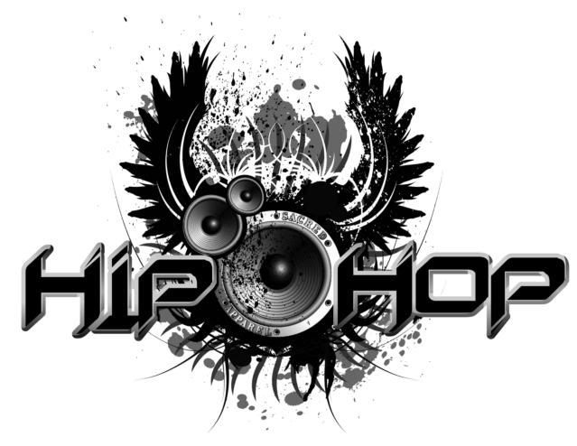

# How To Become A Successful Hip-Hop Star?

There are many treasures hidden behind the lyrics, and we can find many rules and characteristics by exploring them. If you have ever dreamed of becoming a hip hop singer, you may want to get some inspiration through the secrets hidden in the lyrics.

The dataset we've got is from  [Kaggle](https://www.kaggle.com/gyani95/380000-lyrics-from-metrolyrics). It contains lyrics in 125704 songs from all variety of genres and ranging from year 1968 to 2016. 

[TOC]

## Part 1. Keep Up With Hip-Hop

Let's start our journey with analyzing the most common used words in the lyrics. 

### 1. Topics Of All Songs

The following word cloud plots showing the transition of frequent words appearing in all songs during the half century. Each one summarizes the 30 most popular words in a decade.

From the above picture we can see that in these decades, the songs are basically created around a couple of core words. Topics about love and time are always the eternal theme in lyrics and do not fade as time goes by.

But if you think you don't need to be creative to become a successful Hip-Hop singer, then you are very wrong. Life is never that simple.

### 2. Topics Of Hip-Hop

Let's take a look at the evolution happened for Hip-Hop genre.

According to the word clouds above, there are some interesting changes. First of all, in the early days of Hip-Hop songs, they don't really care about love. The pursuit of sensuality and material is their focus. In the following decades, the trend start to behave like other genres talking about love and time. Another interesting situation is that dirt words are used more frequent than other songs. 

If you want to be a qualified hip hop singer, you first need to stay at the forefront of fashion, because the words used by hip hop singers change faster than other genres. Most importantly, a hip hop singer must be at least PG-13.

## Part 2. Exceptional Hip-Hop 

### 1. 

### 2. Speak Fast

### 3. Keep Dirty 

### 4. Sentiment Analysis

## Part 3. Are You Eminem?

### 1. 

### 2. 

### 3. Profanity

### 4. Sentiment

## Conclusion

