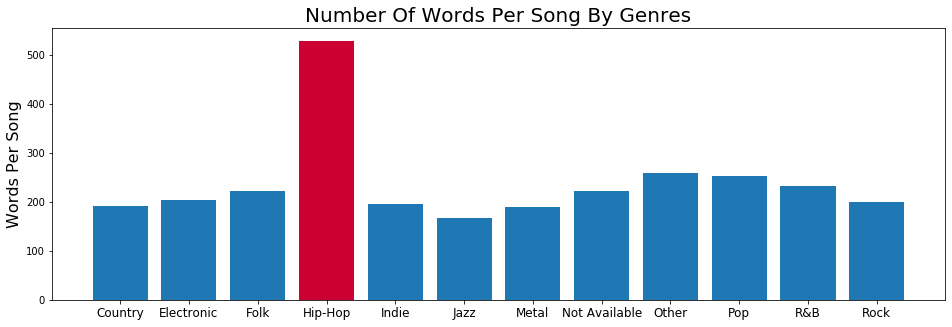
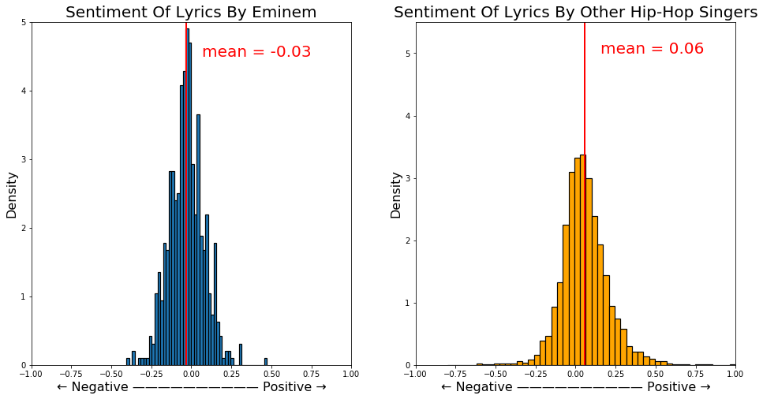

# How To Become A Successful Hip-Hop Star? What's Unique About Hip-Hop?

There are many treasures hidden behind the lyrics, and we can find many rules and characteristics by exploring them. If you have ever dreamed of becoming a hip hop singer, you may want to get some inspiration through the secrets hidden in the lyrics.

The dataset we've got is from  [Kaggle](https://www.kaggle.com/gyani95/380000-lyrics-from-metrolyrics). It contains lyrics in 125704 songs from all variety of genres and ranging from the year 1968 to 2016. 

[TOC]

## Part 1. Keep Up With Hip-Hop

Let's start our journey by analyzing the most commonly used words in the lyrics.

### 1. Evolution Of All Lyrics

The following word cloud plots are showing the transition of frequent words appearing in all songs during the half-century. Each one summarizes the 30 most popular words in a decade.

From the above picture we can see that in these decades, the songs are basically created around a couple of core words. Topics about love and time are always the eternal theme in lyrics and do not fade as time passes by. Nothing interesting here.

But if you think you don't need to be creative to become a successful Hip-Hop singer, then you are very wrong. Life is never that simple.

### 2. Evolution Of Hip-Hop Lyrics

Now Let's take a look at the evolution for Hip-Hop only.

According to the word clouds above, there are some interesting changes. First of all, in the early days of Hip-Hop songs, they don't really care about love. The pursuit of sensuality and material is their focus. In the following decades, the trend starts to behave like other genres talking about love and time. Another interesting situation is that dirt words are used more frequently than other songs.

Hip-hop originated from the bottom people of the United States. At that time, the United States had huge problems such as huge gap between the rich and the poor and racial discrimination. In the face of a huge class divide, the black people who are discriminated against are destitute, are powerless to change. They can only choose to use dirty words and expressions to vent their dissatisfaction with social injustice and dissatisfaction with white people.

From another perspective, if you want to be a qualified hip hop singer, you need to be comfortable with dirty words.

## Part 2. Exceptional Hip-Hop 

In this part, we compare the differences between Hip-Hop and other genres from multiple aspects.

### 1. Most Common Words

By separating out the Hip-Hop from all other styles, we can have a clear comparison of the most common words.

Although Hip-Hop singers like to use dirty languages, words like 'love', 'time', 'baby' still appears in both categories and rank top. It says these topics are really the most concerned ones among all the works of life.

This shows that if you want to be a Hip-Hop singer, you don't need to be completely different from everyone else. There are many similarities between the singers' hotspots and the topics they want to express. You just need to learn to say more swearing words.

### 2. Size Of Vocabulary

In this part, we want to find some characteristics of Hip-Hop song's word numbers. We all know that Hip-Hop needs to speak fast, but how much faster are they? The following graphs show the characteristics of average word count by all genres.

The bar plot above shows that the average words per song are more than twice as many others, which makes this type of genre very distinct. As a common confusion, R&B is hardly distinguished from Hip-Hop by many people. But as depicted above, the number of words between these two is enormous.

In addition, with the assumption that the average song length is almost the same across different genres, it can be concluded that Hip-Hop singers must speak more than twice as faster as other singers. 

From the box diagram above, we can also see that there is about 25 percent Hip-Hop whose lyrics are in the same range of other genres. This means if you can't sing very fast, you still have a chance to become a Hip-Hop singer.

### 3. Amount Of Profanity

Since we all know that Hip-Hop songs like to use junk words, how often do they use them? Now we pick out the four most common swear words and compare their frequencies to other non-hip hop styles.

Although swearing is used in other song styles, we see that Hip-Hop songs use swearing much more than other songs. The most obvious of these is the n-word. Because it is a very typical word for racial discrimination, other genres are avoiding to make trouble.

### 4. Sentiment Analysis

`TextBlob` is a popular python library to implement sentiment analysis. It returns a polarity  and subjectivity  value for each song. The polarity score is a float within the range [-1.0, 1.0] where -1 is negative and 1 is positive. The subjectivity is a float within the range [0.0, 1.0] where 0.0 is very objective and 1.0 is very subjective.

We can find that the emotions of Hip-Hop songs are not more negative or positive than the songs of other styles. Conversely, Hip-Hop songs are more focused on neutral styles as its both histogram are much deeper than other genres. Overall, they all tend to be positive 

## Part 3. Are You Eminem?

Now let's focus on a hip hop singer —— Eminem. As a very successful hip hop singer, let's see if we can find some secrets of success from his lyrics.

### 1. Most Common Words

In this part, we want to see what is the difference between the most commonly used words in Eminem's lyrics and others and to check whether Eminem’s success is related to his common words. We compare them by examining some of the most frequently used words.

According to these two word clouds, there are some noticing differences between Eminem and other Hip-Hop singers. Eminem does not emphasize 'love' like others. Instead, he uses more dirty words than usual as 'bxxxx' and 'sxxx' are quite prominent in the left plot. In addition, because he's a white man, he uses many 'white' to represent his identity and culture. That is a huge difference between himself and other typical Hip-Hop singers. The high frequency of words 'eminem', 'shady' and 'slim' also shows his unique existence and alter ego.

### 2. Size Of Vocabulary

Let's compare the song and lyrics data of Eminem and other hip hop singers.

Eminem has the second largest number of songs among these singers, with approximately 50 songs behind Chris Brown. Such a large output, on the one hand, shows the singer's enthusiasm for music. On the other hand, it also highlights the singer's own talent. 

Although his total number of songs is the second, when the number of songs is large, the unique words will not actually increase much for each additional song, as most of the words are actually repeated. So by checking the use of unique words, we can find that Eminem has used the largest number of unique words in his lyrics, reflecting his quite diverse vocabulary list. 

We can conclude from this point of view that being a successful Hip-Hop singer still requires a lot of knowledge accumulation. Hip-Hop culture comes from the bottom does not mean that you can put no efforts to learn.

Many people think that it's quite clear to hear Eminem's singing. Now we can know if it's the case by comparing the lyrics speed of the Hip-Hop singers by the number of lyrics in each song.

Eminem’s singing speed is actually fast, as you can see he is still in the top position among all Hip-Hop singers. However, he is not an alien. He still belongs to the normal range of singing speed among all Hip-Hop singers. This shows that Eminem does not stand out by his speed of singing.

### 3. Amount Of Profanity

The interesting finding here is Eminem uses more than average amount of profane words except the n-word. On the one hand, he still maintains the characteristics of Hip-Hop singers and likes to use swear words to express his dissatisfaction and criticism of the society. On the other hand, he also emphasizes his particularity, and will not discuss too many cultures that are not his own.

### 4. Sentiment Analysis

Eminem is quite different. His lyrics are even more centric than other Hip-Hop singers, and tend to be somewhat negative. In the meantime, although the averaged subjectivity is neutral, he has many biased songs that expresses his attitude explicitly.

## Conclusion

What was our goal for the EDA portion of our journey? **To be able to take an initial look at our data and see if the results of some basic analysis made sense.**

My conclusion - yes, it does, for a first pass. There are definitely some things that could be better cleaned up, such as adding more stop words or including bi-grams. But we can save that for another day. The results, especially the profanity findings, are interesting and make general sense, so we're going to move on.

As a reminder, the data science process is an interative one. It's better to see some non-perfect but acceptable results to help you quickly decide whether your project is a dud or not, instead of having analysis paralysis and never delivering anything.

